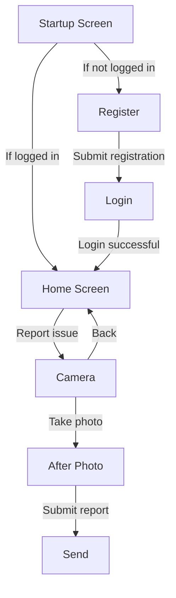

# DaPasstWasNicht

This project aims to simplify the process of reporting issues, whether users are at work, outdoors, or at home. The app will include a clean, modern design and intuitive navigation to guide users through reporting problems efficiently. 

The development will start with **basic features**, followed by the addition of **advanced functionalities**. The app will use **Expo Go** for testing during development and **React Native** for the frontend.

---

## Basic Features

### 1. **Startup Screen**
- An engaging splash screen with:
  - An animated illustration of a building undergoing repairs.
  - A progress bar.
- Directs users to:
  - The registration page (if not logged in).
  - The home screen (if logged in).

### 2. **Log In and Registration Screen**
- Minimalist design with ample white space.
- Clearly labeled fields for:
  - Email.
  - Password.
- Options for:
  - Creating a new account.
  - Signing in using Google.

### 3. **Home Screen**
- The central hub of the app.
- Features:
  - A clear, intuitive layout.
  - A prominent button for reporting an issue (via photo).
  - Hints at future functionalities to ensure seamless app evolution.

### 4. **Photo Screen**
- A Snapchat-like camera interface:
  - Full-screen camera preview.
  - Large circular shutter button at the bottom for simplicity and focus.

### 5. **After Photo Screen**
- Displays a small preview of the captured photo.
- Shows the location where the photo was taken.
- Includes:
  - A text field for adding a detailed description of the issue.
  - Buttons for:
    - Retaking the photo.
    - Sending the report.

---

## Future Features

### 1. **Payment Integration**
- Connect PayPal or other banking details.
- Users can receive rewards from the entity that resolves the issue, motivating proactive reporting.

### 2. **Multi-Level Issue Management**
- Handles:
  - Private issues.
  - City-wide issues.
  - Company-specific issues.
- Example Use Case:
  - Reporting a broken lamp at home or a problem in a restaurant.
  - The app uses photo location data to determine the most relevant entity.
- Businesses:
  - Will have accounts to receive reports.
  - Can respond with rewards like money, coupons, or other incentives.

---



---

```tree
The github is https://github.com/Mundgelenk/DaPasstWasNicht 
the folder structure should be similar to : /project-root
├── /assets
│   ├── /images               # All static images (icons, logos, etc.)
│   │   ├── logo.png
│   │   ├── splash.gif
│   │   └── background.jpg
│   └── /fonts                # Custom fonts if used
│       ├── Roboto-Regular.ttf
│       └── Roboto-Bold.ttf
│
├── /src
│   ├── /components           # Reusable UI components (buttons, headers, etc.)
│   │   ├── Button.tsx
│   │   ├── Header.tsx
│   │   └── Card.tsx
│   │
│   ├── /screens              # Each major view gets its own folder
│   │   ├── /StartupScreen
│   │   │   ├── StartupScreen.tsx
│   │   │   └── StartupScreen.styles.ts
│   │   ├── /LoginScreen
│   │   │   ├── LoginScreen.tsx
│   │   │   └── LoginScreen.styles.ts
│   │   ├── /HomeScreen
│   │   │   ├── HomeScreen.tsx
│   │   │   └── HomeScreen.styles.ts
│   │   ├── /PhotoScreen
│   │   │   ├── PhotoScreen.tsx
│   │   │   └── PhotoScreen.styles.ts
│   │   └── /AfterPhotoScreen
│   │       ├── AfterPhotoScreen.tsx
│   │       └── AfterPhotoScreen.styles.ts
│   │
│   ├── /navigation           # Navigation setup (e.g., stack, tab, drawer)
│   │   ├── AppNavigator.tsx
│   │   └── routes.ts
│   │
│   ├── /services             # API calls, authentication, backend integration
│   │   ├── firebase.ts       // Firebase configuration and initialization
│   │   ├── authService.ts    // Firebase auth methods
│   │   └── reportService.ts  // Methods for handling issue reports
│   │
│   ├── /constants            # App-wide constants (colors, font sizes, etc.)
│   │   ├── colors.ts
│   │   ├── fonts.ts
│   │   └── index.ts
│   │
│   ├── /utils                # Helper functions and utilities
│   │   ├── helpers.ts
│   │   └── validation.ts
│   │
│   └── /store                # State management (Redux slices or Context providers)
│       ├── index.ts          // Store configuration
│       ├── rootReducer.ts
│       └── slices
│           ├── userSlice.ts
│           └── reportSlice.ts
│
├── /server                   # (Optional) Custom backend code if needed
│   ├── /api                  # Express (or other framework) routes and controllers
│   │   ├── index.js
│   │   └── reports.js
│   │
│   ├── /models               # Database models/schemas (if using a custom backend)
│   │   ├── reportModel.js
│   │   └── userModel.js
│   │
│   └── /controllers          # Business logic for handling requests
│       ├── reportController.js
│       └── userController.js
│
├── app.json                  # Expo configuration
├── package.json              # Project dependencies and scripts
└── README.md                 # Project documentation
```
